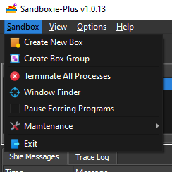
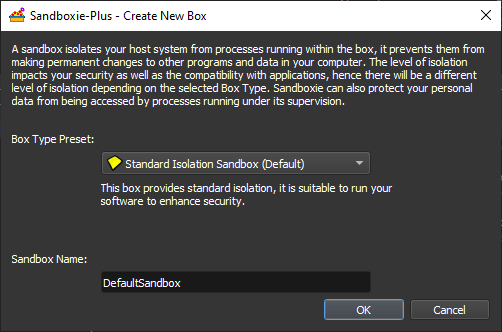
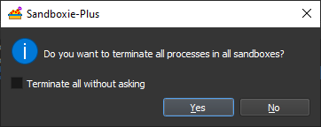
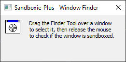

# Sandbox Menu

_[Sandboxie Control](SP_SBControl.md) > Sandbox_

* * *

### Create New Box

The _Create New Box_ command defines a new sandbox in Sandboxie. A dialog box window will be displayed asking for the
name of the new sandbox. The name can be any of combination of digits and letters, and its maximum length is 32
characters.

From the _Box Type Preset_ window, you can chose a default set of settings for your sandbox.
See [Box Type Presets](BoxTypePresets.md) for more detail.

A combobox button can specify some existing sandbox, from which settings will be copied into the new sandbox. If such an
existing sandbox has not been selected, the new sandbox will initially have a default set of settings.

Once the sandbox is created, you can alter its settings by double clicking the sandbox
in [Sandboxie Control](SP_SBControl.md) to open its [Sandbox Settings](SandboxSettings.md).
* * *

### Create Box Group

This creates a Box Group. This does not have any effect on how programs behave within a sandbox. Box Groups are a way to
visually group together sandboxes, and restrict which are shown in the [Programs View](SBControl_ProgramsView.md).
See [Box Groups](BoxGroups.md) for more detail.
* * *

### Terminate All Processes

This terminates all the processes in all the sandboxes. Unless explicitely disabled, a popup will ask for confirmation.

* * *

### Window Finder

The _Window Finder_ command is used to select a window displayed on the screen, and if the window is owned by a
sandboxed program, the command displays the name of the program and the sandbox it is running in.

The _Is Window Sandboxed?_ command is used to select a window displayed on the screen, and if the window is owned by a
sandboxed program, the command displays the name of the program and the sandbox it is running in.

To use the command, click and hold the left mouse button on the _Window Finder_ target. Without releasing the left mouse
button, drag the target over the desired window, and when the target is within the boundaries of the desired window,
release the left mouse button.

If the window is owned by a sandboxed program, Sandboxie will display the program name and sandbox name.

Some programs display their windows using customized graphics, and this prevents Sandboxie from showing the [#]
indicators in the title bar. In these cases, you can use the _Window Finder_ command to make sure that the window and
its related program are running sandboxed.

* * *

### Pause Forcing Programs

The _Pause Forcing Programs_ toggle command temporarily disables or re-enables forced sandboxing. Normally,
any [forced programs](ProgramStartSettings.md#forced-programs) (or programs in
any [forced folders](ProgramStartSettings.md#forced-folders)) will automatically start under the supervision of
Sandboxie. Forced sandboxing is temporarily suspended when the _Pause Forcing Programs_ command is invoked.

By default, forced sandboxing is suspended for 10 seconds. The number of seconds can be changed in the following dialog
box, which appears when you select this command.

For the duration that the Disable Forced Programs mode is in effect:

* The Sandboxie icon in the system tray area includes a small red X.
* The "Pause Forcing Programs" command in the [Sandbox Menu](SBControl_SandboxMenu.md)
  and [Tray Icon Menu](TrayIconMenu.md) appears with a checkmark next to it.
* Message [SBIE1301](SBIE1301.md) will be issued if any forced programs are started.
* Selecting this command again will cancel the mode, restore the icon to its original appearance, and resume the normal
  operation of forced sandboxing.

See also: [Tray Icon Menu > Pause Forcing Programs](TrayIconMenu.md#pause-forcing-programs)

* * *

### Maintenance

TODO

* * *

### Exit

The _Exit_ command quits [Sandboxie Control](SP_SBControl.md). Note that merely closing the window (or selecting the _
Hide Window_ command from the [Tray Icon Menu](TrayIconMenu.md)) _does not_ quit Sandboxie Control.

Sandboxie is still active and correctly supervise programs even when the front-end application, Sandboxie Control, is
not running. However, the following features are provided by Sandboxie Control and will not be available when the
front-end program is not running:

* [Automatic Delete Sandbox](SettingsGeneralOptions.md#file-options)
* [Immediate Recovery](ImmediateRecovery.md) and [Recovery](SP_Recovery.md)
* [Disable Forced Programs mode](SBControl_SandboxMenu.md#pause-forcing-programs) (when initiated from
  the [Sandboxie Start](StartCommandLine.md) program)

If you do not wish to see Sandboxie Control in your system tray area, consider configuring the Windows task bar to
always hide the icon, rather than exit Sandboxie Control.

* * *

Go to [Sandboxie Control](SP_SBControl.md#menus), [Help Topics](HelpTopics.md).
