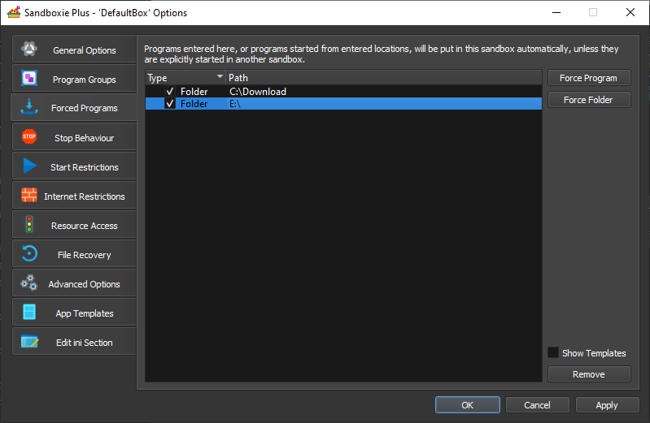
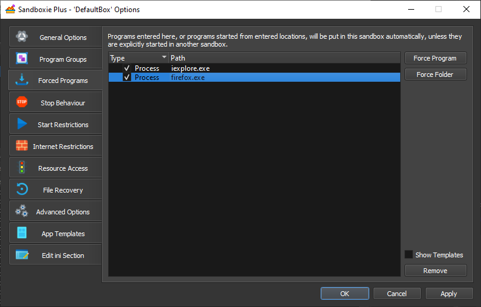

# Forced Folders and Processes

_Forced Folders_ and _Forced Processes_ are a way to force some processes to run in a specific sandbox.

***

### Forced Folders

Once a folder is marked as a _Forced Folder_ for a given sandbox, if any files or programs in the folder (or in its
sub-folders) are started outside any sandbox, they will be automatically sandboxed into the sandbox.

**Modifying a Forced Folder**

* Through the [Sandbox Options > Forced Programs](SP_SBOptions_ForcedPrograms.md) menu:

  
* Through the _ForceFolder=..._ setting in [Sandboxie.ini](SandboxieIni.md):
  ```
     ...
     [DefaultBox]
     ForceFolder=C:\Download
     ForceFolder=E:\
  ```

The first line specifies that files/programs started from the _C:\Download_ folder (or any folders below contained in
those folders) will be forced to run sandboxed in the sandbox _DefaultBox_.

The second line specifies that any files/programs started from drive _E_ will be forced to run sandboxed in the
sandbox _DefaultBox_. For CDROM and DVD drives, this includes forcing the _AutoRun_ programs that are automatically
started by Windows.

_Note_: Please keep in mind that shortcuts located inside a _Forceed Folder_, that are pointing to a path that is not a
_Forced Folder_, will not start a Sandboxed application. For example: if you place a shortcut inside _C:\ForcedFolder_
and it points to _C:\SomeOtherPathThatIsNotForced_, then the shortcut will trigger a non-sandboxed application.

_Note_: Metro apps are not supported. If your default application for opening a specific file type is a Windows Metro
app (such as Windows 10 photo viewer), the application will launch outside the Sandbox. For more information regarding
Microsoft Store apps, please see [Known Conflicts](SP_SandboxieKnownConflicts.md#uwp--modern--microsoft-store-apps).

_Note_: If both a _Forced Folder_ and a _[Forced Process](#force-process)_ are applicable to a program that is starting,
the ForceFolder setting takes precedence.

***

### Forced Processes

Once a process is marked as a _Forced Process_ for a given sandbox, if started outside any sandbox, it will be
automatically sandboxed into the sandbox.

**Modifying a Forced Process**

* Through the [Sandbox Options > Forced Programs](SP_SBOptions_ForcedPrograms.md) menu:

  
* Through the _ForceProcess=..._ setting in [Sandboxie.ini](SandboxieIni.md):
  ```
   ...
   [DefaultBox]
   ForceProcess=iexplore.exe
   ForceProcess=firefox.exe
   [MailBox]
   ForceProcess=outlook.exe
  ```

The example specifies that Internet Explorer (iexplore.exe) and Firefox (firefox.exe) will be forced to run sandboxed in
the sandbox _DefaultBox_. Outlook.exe will be forced to run sandboxed in the sandbox _MailBox_.

_Note_: The _Forced Processes_ settings only apply to programs that start unsandboxed. If a program is specifically
started in a sandbox, or started by a program that is already sandboxed, then _Forceed Processes_ settings are not
applied.

_Note_: Metro apps are not supported. If your default application for opening a specific file type is a Windows Metro
app (such as Windows 10 photo viewer), the application will launch outside the Sandbox. For more information regarding
Microsoft Store apps, please see [Known Conflicts](SP_SandboxieKnownConflicts.md#uwp--modern--microsoft-store-apps).

_Note_: If both a _[Forced Folder](#forced-folders)_ and a _Forced Process_ are applicable to a program that is starting,
the ForceFolder setting takes precedence.
