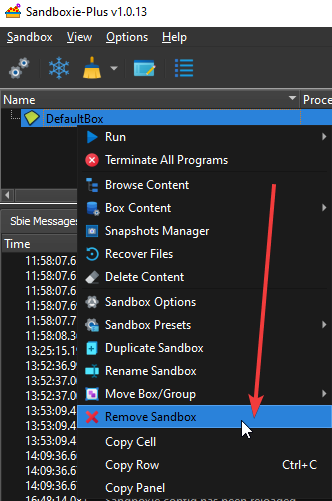

# Getting Started Part Five

### Part Five: Deleting the Sandbox

When you are finished using the application under Sandboxie, and you have recovered the downloaded files, documents and
other desired work items, it is a good idea to delete the contents of the sandbox.

To delete the content of a sandbox, you must first terminate the processes running in the sandbox. Therefore, start by
closing the sandboxed browser.

Then, click the **Delete Content** command in the [Tray Icon Menu](TrayIconMenu.md):

You can also invoke the **Delete Content** command from the [Sandbox Menu](SP_SBControl_SandboxMenu.md) in the main window
of [Sandboxie Control](SP_SBControl.md). The [Delete Sandbox Content](DeleteSandboxContent.md) window appears:

Regardless of the size of the sandbox, the delete process always takes only a few seconds. This should be considered
normal and expected. During this time, the Sandboxie tray icon changes to a red X icon to indicate that sandbox delete
is in progress.

Once you have deleted the sandbox's content, you can delete the sandbox itself by right-clicking the sandbox
in [Sandboxie Control](SP_SBControl.md) and selecting _Remove Sandbox_:

* * *
In the default configuration, the sandbox's content is not deleted automatically, so you will have to manually invoke
the **Delete Content** command whenever you want to delete the contents of the sandbox.

This behavior can be changed by altering a setting. In the main window of [Sandboxie Control](SP_SBControl.md),
double click _DefaultBox_ to open the [Sandbox Options](SP_SBOptions.md) window:

The [Sandbox Options](SP_SBOptions.md) window appears. Navigate to
the [General Options > File options](SBOptions_GeneralOptions.md#file-options) settings page:

Place a checkmark in the box _Auto delete content when last sandboxed process terminates_ to have Sandboxie
automatically invoke the Delete Sandbox Content command.
* * *
The tutorial concludes in [Getting Started Part Six](SP_GettingStartedPartSix.md).
