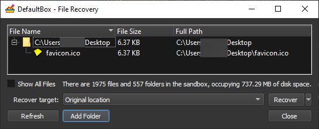
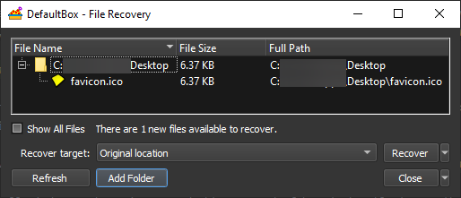

# Getting Started Part Four

### Part Four: Quick Recovery

You may have noticed that when you saved the file _favicon.ico_ to your desktop folder, earlier, Sandboxie
offered [Immediate Recovery](ImmediateRecovery.md) for that file. However, no such offer was made when you saved _
test1.txt_ to the root folder of drive C.

This is because the desktop folder is (by default) configured as a _recoverable_ folder location, from which you will
typically want to recover files. The root folder of drive C is not considered a recoverable location.

The [Recovery](SP_Recovery.md) command scans the recoverable folders and displays a summary of all recoverable files:

You can invoke the **Recover Files** command:

* From the [Sandbox Menu](SP_SBControl_SandboxMenu.md) in the main window of Sandboxie Control.

* By right-clicking the [Tray Icon Menu](TrayIconMenu.md) at the corner of the screen.

* * *
The picture above shows _favicon.ico_ as the only recoverable file, because it was the only file saved to a recoverable
location -- the desktop folder in this case.

Other folder locations that are set as recoverable folders by default are your _Documents_ folder and the Windows
_Favorites_ folder. Where applicable, your _Downloads_ folder is also considered a recoverable folder. Since these
folders don't contain any files eligible for recovery, they are not listed at all in the picture above.

You can use the _Add Folder_ button to add more folders to Quick Recovery.

ALternatively, you can tick _Show All Files_ to view and recover any file that resides anywhere in the sandbox.
* * *
When recovering a file (or a folder), you can choose to recover the file to the corresponding location outside the
sandbox -- for example, from the sandboxed desktop folder, to the real desktop. The _Recover target: Original location_
option in the picture above does that.

Alternatively, you can use the _Recover target: Browse for location_ option, which can move the sandboxed file to any
folder location in your computer system.
* * *

### Immediate Recovery

The [Immediate Recovery](ImmediateRecovery.md) feature, which was mentioned briefly in the previous part of this guide,
is an extension of [Recovery](SP_Recovery.md). Immediate Recovery keeps scanning the same set of recoverable folders, and
will enable you to recover files as soon as they are created:

* * *
Summary:

* Files must be created in recoverable folders if they are to be noticed by [Recovery](SP_Recovery.md)
  and [Immediate Recovery](ImmediateRecovery.md).

* You can customize the set of recoverable folders.

* You can tick _Show All Files_ to recover files that do not reside in any recoverable folder.

* * *

The tutorial continues in [Getting Started Part Five](SP_GettingStartedPartFive.md).
