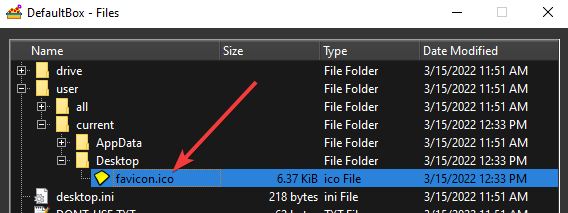
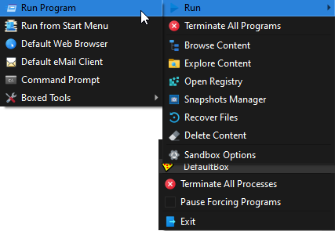
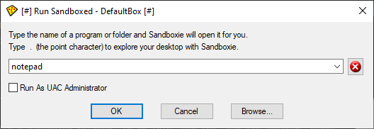
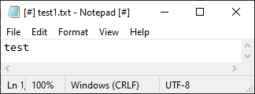
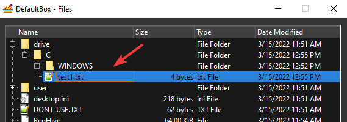

# Getting Started Part Three

### Part Three: The Sandbox

You should now have your Web browser running _sandboxed_. It can be Firefox or any other browser.

<u>**If you haven't done so already, open the current tutorial in the sandboxed browser**</u>

The browser program may make changes to your computer. These changes will all be trapped in the sandbox.

Try it now. Right-click on [this link](https://github.com/sandboxie-plus/sandboxie-docs/raw/main/Media/favicon.ico), and
save the file to your desktop. If you're using Firefox, this is the _Save Link As_ command in the right-click menu. If
you're using Internet Explorer, this is the _Save Target As_ command in the right-click menu:

In the default and recommended configuration, Sandboxie will identify that a file was saved to an interesting location
-- your desktop, in this case -- and will offer [Immediate Recovery](ImmediateRecovery.md) for the file:

Because the point of this exercise is to show that files remain in the sandbox unless recovered, click the _Close_
button on the window above, to tell Sandboxie to keep the file in the sandbox.

The file you saved, _favicon.ico_ would appear on your desktop as this
icon: 

If you minimize all windows and examine your desktop, you should _not_ be able to see the new icon, because the file was
in fact saved _in the sandbox_, and not yet recovered.

[Sandboxie Control](SP_SBControl.md) shows the [Programs View](SBControl_ProgramsView.md) where it lists the programs running
in the sandbox, but you can use the [Content Browser](ContentBrowser.md) to explore the contents of the sandbox. Right
click _DefaultBox_ then click _Browse Content_.

Expand the branches (by clicking the **_+_** signs) to reveal the contents of the sandbox, arranged into folders. As you
can see in the picture directly above, the file _favicon.ico_ that you saved earlier has been placed in the _sandboxed_
desktop folder.
* * *
In the same way, any file created by any sandboxed program will be placed in a sandbox folder corresponding to the real
folder where it _should have_ been placed.

Let's try this again, this time with a sandboxed Notepad. To do this, use the _Run Program_ command:

Sandboxie displays its _Run..._ dialog box. Type **notepad**:

Notepad should start sandboxed:

Type a few letters into the new Notepad document, and save it as file _test1.txt_ at the root folder of drive C. Then,
look for this file in the root folder of drive C. You should not be able to find it. That's because the file was saved
in the sandbox:

* * *
Summary:

* Files created or modified by sandboxed programs are initially placed in the sandbox.

* Files in the sandbox are not visible to programs outside the sandbox.

* * *
The tutorial continues in [Getting Started Part Four](SP_GettingStartedPartFour.md).
