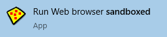

# Getting Started Part Two

### Part Two: Run Web Browser

To launch your Web browser, find the start menu entry for _Run Web browser sandboxed_:

Alternatively, either in the [Sandboxie Control tray icon](SP_TrayIconMenu.md) or directly
in [Sandboxie Control](SP_SBControl.md), right click _DefaultBox_ and select _Run &rarr; Default Web Browser_.

* * *
Your Web browser should come up _sandboxed_. You can tell that a program is sandboxed because its window title bar
contains additional Sandboxie **[#]** indicators:

_**NOTE**: Newer browsers may not show the # in the title bar, however if you hover your mouse along the edges of the
window, it will turn yellow._

_**Note**: In some computer systems, Sandboxie starts the wrong program when you select _Run &rarr; Default Web Browser_
. If this is the case for you,
see [Frequently Asked Questions](SP_FAQ.md#why-does-the-wrong-program-start-when-i-run-my-default-web-browser-sandboxed)
to fix this._

The sandboxed program should appear in the main window of [Sandboxie Control](SP_SBControl.md):

The window displays the list of programs that are currently running _sandboxed_ under the supervision of Sandboxie.
Initially there is just one sandbox, _DefaultBox_, however, more sandboxes can be created; see
the [Create New Sandbox](SP_SBControl_SbMenu.md#create-new-sandbox) command in the [Sandbox Menu](SP_SBControl_SbMenu.md).

The picture above shows Sandboxie is running four programs. The last, _firefox.exe_, stands for Firefox, as this
tutorial assumes Firefox is the Web browser in use. If the default Web browser in your system is Internet Explorer, or
Opera, then you would see _iexplore.exe_ or _opera.exe_, respectively.

The screenshot shows three more programs are running (**SandboxieRpcss.exe**, **SandboxieDcomLaunch.exe**, **
RuntimeBroker.exe**). These support programs are part of Sandboxie. If they are needed, they will be automatically
started, without any explicit action on your part. See [Service Programs](ServicePrograms.md).

When Sandboxie is actively running programs in any of the sandboxes, the Sandboxie tray icon (at the corner of the
screen) displays red dots: 
* * *
The tutorial continues in [Getting Started Part Three](SP_GettingStartedPartThree.md).
