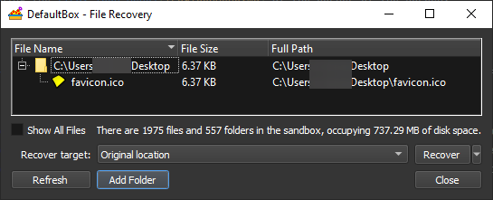

# Recovery

_[Sandboxie Control](SP_SBControl.md) > [Sandbox Menu](SP_SBControl_SandboxMenu.md) > Sandbox > Recover Files_

_[Sandboxie Control](SP_SBControl.md) > [Tray Icon Menu](TrayIconMenu.md) > Sandbox > Recover Files_

Sandboxed programs create files and folders inside the sandbox. It may be desirable to move some of these created files
out of the sandbox. For instance, a document file downloaded by a sandboxed browser is saved into the sandbox, but that
file can be extracted and placed in the _Documents_ folder outside the sandbox.

A rudimentary approach is to use the regular, non-sandboxed Windows Explorer to navigate inside the folders that make up
the sandbox. By using the _[Sandbox Menu](SP_SBControl_SandboxMenu.md) > Sandbox > Box Content > Explore Content_ command, you can
open a folder window (unsandboxed) with a view into the sandbox. You can then navigate in the depth of the sandbox
folder, and _cut_ sandboxed files in order to _paste_ them somewhere else.

The Recovery feature makes it easier to extract files (and even whole folders) that are created and saved by sandboxed
programs. It scans a few sandboxed folders, which have to be selected in advance, and lists the files (and folders) it
finds within them. These files (and folders) can be recovered into the corresponding location outside the sandbox, or to
any location.

To invoke the Recovery window, use the _[Sandbox Menu](SP_SBControl_SandboxMenu.md) > Sandbox > Recover Files_
command (or the corresponding command from the [Tray Icon Menu](TrayIconMenu.md)). Recovery also appears as part of
the [Delete Sandbox Content](DeleteSandboxContent.md) window.

**The Recovery Window**

The central area of the window shows the quick-recoverable files and folders in a particular sandbox. Select a file or
folder and click the _Recover_ button to recover the files:

* _Recover target: Original location_: the file (or folder) from the sandbox is recovered to its corresponding location
  outside the sandbox. For example, the picture above shows the file _favicon.ico_ in the sandboxed _Desktop_ folder.
  Chosing this command will move it to the real Desktop folder.

* _Recover target: Browse for location_ first displays a _Select Directory_ dialog box, then moves the file (or folder)
  to the folder selected in the dialog box once _Recover_ is pressed.

_Note_: You can also recover your files/folders in the [Content Browser](ContentBrowser.md), by right-clicking it.

**Adding Folders to Recovery**

As noted, Recovery only scans folders which are explicitly selected. By default, it scans the _Desktop_, _Favorites_
and _Documents_ folders. Where applicable, your _Downloads_ folder is also considered a recoverable folder.

* You can add more folders using the _Add Folder_ button.

* You can use [Sandbox Options > File Recovery](RecoverySettings.md) to add and remove folders.

* * *
Go to [Delete Sandbox Content](DeleteSandboxContent.md), [Immediate Recovery](ImmediateRecovery.md)
, [Sandboxie Control](SP_SBControl.md), [Help Topics](HelpTopics.md).
