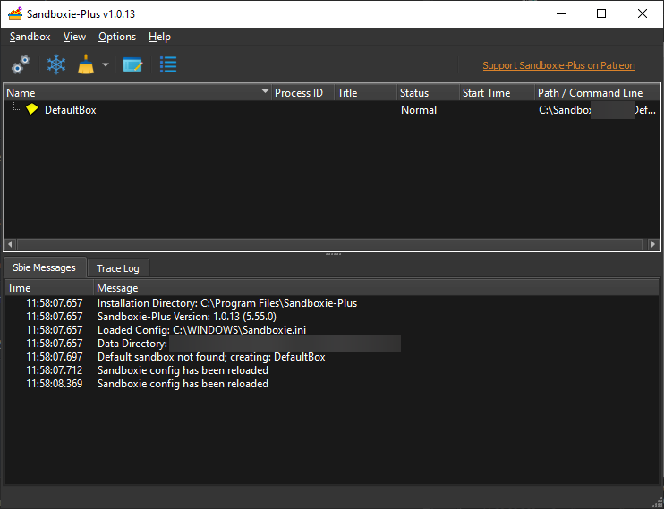

# Sandboxie Control

### Overview

Sandboxie Control is the graphical front end to Sandboxie, and can control most aspects of Sandboxie. These are some of
the things that you can do with it:

* Start and stop programs under the supervision of Sandboxie
* View files inside the sandbox
* Recover desired files out of the sandbox
* Delete the contents of sandboxes, purging all undesired files
* Create, remove and configure sandboxes

* * *

### Menus

* Main Menu:

    * [Sandbox Menu](SP_SBControl_SandboxMenu.md)

    * [View Menu](ViewMenu.md)

    * [Options Menu](SBControl_OptionsMenu.md)

    * [Help Menu](SBControl_HelpMenu.md)

* See Also: [Tray Icon Menu](SP_TrayIconMenu.md)

* * *

### Visibility

Sandboxie is primarily a mechanism to run other programs, not an interactive tool. You will typically hide the main
window of Sandboxie Control, and the program will only be visible as a tray icon in your system notification area,
typically at the lower-right corner of the screen:

To toggle the hidden state, double-click the tray icon, or right-click it and select _Show/Hide_ (
see [Tray Icon Menu](SP_TrayIconMenu.md)). Additionally, you can hide the window by clicking the close button (
X) at the upper-right corner of the window.

To quit Sandboxie Control and remove its tray icon from the system notification area, right-click the tray icon and
select _Exit_.
* * *

### Views

* [Programs View](SP_SBControl_ProgramsView.md)
* [Log View](SBControl_LogView.md)

* * *

### Quick Links to More Topics

* [Recovery](SP_Recovery.md), [Immediate Recovery](ImmediateRecovery.md)
  and [Delete Sandbox Content](DeleteSandboxContent.md)

* [Sandbox Options](SP_SBOptions.md)

* [Disable Forced Programs](FileMenu.md#disable-forced-programs)

* [Shell Integration](SBControl_OptionsMenu.md#windows-shell-integration)

* [Is Window Sandboxed?](FileMenu.md#is-window-sandboxed)

* * *

Go to [Help Topics](HelpTopics.md).
