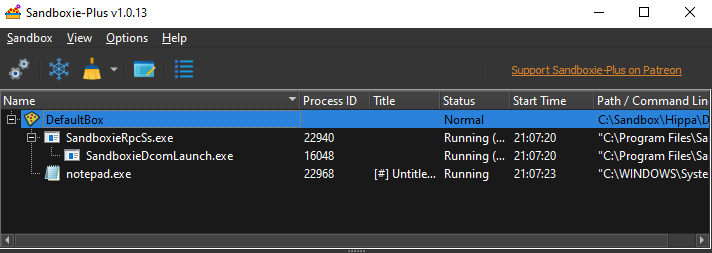

# Programs View

[Sandboxie Control](SP_SBControl.md) > Main View

The _Programs View_ is the default view mode in [Sandboxie Control](SP_SBControl.md). It displays the programs running
in each of the sandboxes, grouped by sandbox name. The list shows several colums:

* The _Name_ column displays the name of the executable file of the program. For example, the picture shows
  _notepad.exe_, which is the executable name for Notepad.
    * For a row describing a sandbox, this column displays the name of the sandbox.
* The _Process ID_ column displays the process ID of the program. This is the same number that appears in the Processes
  tab of the Windows Task Manager.
* The _Title_ column displays the title associated with the main window of the program.
* The _Status_ column displays the status associated with the program/sandbox.
* The _Start Time_ column displays the time at which the program was started.
* The _Path / Command Line" column displays the path of the sandbox / the command line used to launch the program.

Use the small _+_ or _-_ icon located at the start of each row to expand or collapse the display of programs in the
sandbox.

* * *

### Context Menus

The _Programs View_ provides context menus for sandboxes and programs. To display a context menu for the item (sandbox
or program) in some row, do one of the following:

* Right-click anywhere on the row.
* Select (highlight) the row using the mouse or keyboard, then press Shift+F10.

For a sandbox row, the context menu displayed is [Sandbox submenu](SP_SandboxSubmenu.md), see there for a full description.

For a program row, the context menu offers these commands:

* The _Terminate_ command terminates the program.

* The _Create Shortcut_ command creates a shortcut to run the program in the current sandbox.

* The _Preset_ submenu contains:
    * Pin to Run Menu: this adds a shortcut to this program in [Sandbox submenu > Run](SP_SandboxSubmenu.md#run).
    * Block and Terminate: TODO
    * Allow Internet Access: this enables Internet Access for the program, provided that Internet Access is restricted
      (see [Internet Restrictions](SBOptions_InternetRestrictions.md)). If Internet Access if not restricted, it will
      prompt to do so.
    * Force into this sandbox: this adds the program to [Forced Programs](SBOptions_ForcedPrograms.md).
    * Set Linger Process: TODO
    * Set Leader Process: TODO
* Copy Cell / Row / Panel: copies the cell / row / panel's content to the clipboard.

* * *

Go to [Sandboxie Control](SP_SBControl.md), [Files And Folders View](FilesAndFoldersView.md)
, [Help Topics](HelpTopics.md).
