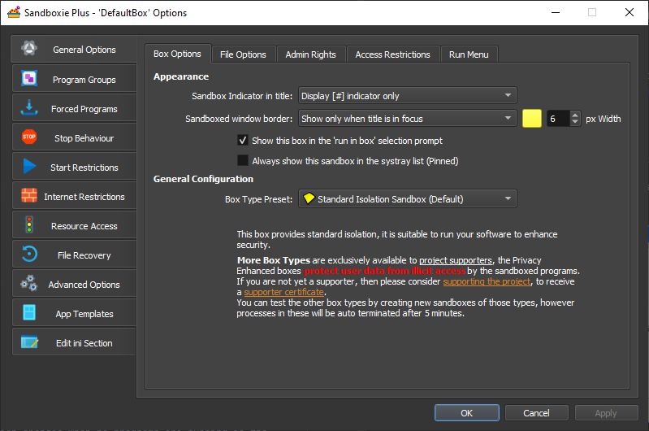

# Sandbox Options

The Sandbox Options window in [Sandboxie Control](SP_SBControl.md) displays and changes the configuration and options
associated with a single sandbox. The Sandbox Options window can be accessed in two ways:

* From the [Programs View](SBControl_ProgramsView.md): Double-click the sandbox

* From either the [Programs View](SBControl_ProgramsView.md) or the [Tray Icon Menu](TrayIconMenu.md): Right-click on
  the sandbox, then select _Sandbox Options_.

Note that unless new sandboxes are added, Sandboxie lists only one sandbox: DefaultBox.

* * *

In the Sandbox Options window, the individual options are organized into options pages, and some pages are organized
into tabs, as shown below.

The left part of the window contains the pages. When an options page is selected (clicked) in the left part of the
window, the right part of the window shows the related options, sometimes organised in tabs.

Changes may be applied either by pressing _Apply_, which does not close the Options window, or by pressing _OK_ which
closes the window.

The sections below describe each options page.

Configuration changes do not apply to programs that are already running sandboxed at the time the configuration is
changed. To keep things simple, you are advised to make configuration changes when no programs are running in the
sandbox.
* * *

For information about the settings, see these pages:

* [General Options](SBOptions_GeneralOptions.md)

* [Program Groups](SBOptions_ProgramGroups.md)

* [Forced Groups](SBOptions_ForcedPrograms.md)

* [Stop Behaviour](SBOptions_StopBehaviour.md)

* [Start Restrictions](SBOptions_StartRestrictions.md)

* [Internet Restrictions](SBOptions_InternetRestrictions.md)

* [Resource Access](SBOptions_ResourceAccess.md)

* [File Recovery](SBOptions_FileRecovery.md)

* [Advanced Options](SBOptions_AdvancedOptions.md)

* [App Templates](SBOptions_AppTemplates.md)

* [Edit ini Section](SBOptions_EditIniSection.md)

