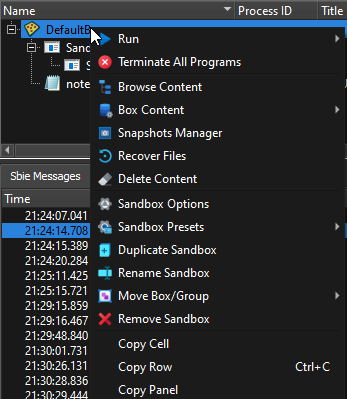

# Sandbox Submenu

When right-clicking a sandbox in [Sandbox Control > Programs View](SP_SBControl_ProgramsView.md) a submenu pops up.

When right-clicking a sandbox in the [Tray Icon Menu](TrayIconMenu.md), a reduced version of this same submenu is
displayed.

### Run

The _Run_ sub-sub-menu is used to start programs under the supervision of Sandboxie:

* _Run Program_: displays a dialog box which is similar to the standard Windows _Run..._
  dialog box. It can be used to start programs, open documents, and browse folders, all under the supervision of
  Sandboxie.

* _Run from Start Menu_: displays the Sandboxie Start menu, similar to the standard Windows Start menu. It can be used
  to start programs and other shortcuts that appear in the start menu and on the desktop. Note that if any programs were
  installed into the sandbox, the Sandboxie Start menu will include the shortcuts created during the installation. The
  files specific to the sandbox are displayed at the top of each folder's content.

* _Default Web Browser_: starts the system (default) Web browser.
  (Note: If the wrong program starts,
  see [Frequently Asked Questions](FrequentlyAskedQuestions.md#why-does-the-wrong-program-start-when-i-run-my-default-web-browser-sandboxed)
  to fix this.)
* _Default eMail Client_: starts the system (default) email reader.
* Command Prompt: starts a command prompt