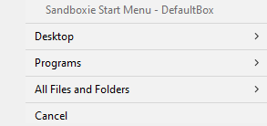

# Sandbox Submenu

When right-clicking a sandbox in [Sandbox Control > Programs View](SP_SBControl_ProgramsView.md) a submenu pops up.

When right-clicking a sandbox in the [Tray Icon Menu](SP_TrayIconMenu.md), a reduced version of this same submenu is
displayed.

### Run

The _Run_ sub-sub-menu is used to start programs under the supervision of Sandboxie:

* _Run Program_: displays a dialog box which is similar to the standard Windows _Run..._
  dialog box. It can be used to start programs, open documents, and browse folders, all under the supervision of
  Sandboxie.

* _Run from Start Menu_: displays the Sandboxie Start menu, similar to the standard Windows Start menu. It can be used
  to start programs and other shortcuts that appear in the start menu and on the desktop. Note that if any programs were
  installed into the sandbox, the Sandboxie Start menu will include the shortcuts created during the installation. The
  files specific to the sandbox are displayed at the top of each folder's content.

* _Default Web Browser_: starts the system (default) Web browser.
  (Note: If the wrong program starts,
  see [Frequently Asked Questions](SP_FAQ.md#why-does-the-wrong-program-start-when-i-run-my-default-web-browser-sandboxed)
  to fix this.)
* _Default eMail Client_: starts the system (default) email reader.
* _Command Prompt_: starts a command prompt
* _Boxed Tools_: TODO
    * The _Windows Explorer_ command starts a sandboxed instance of the Windows Explorer. It can be used to navigate
      folders and start programs, all under the supervision of Sandboxie.

### Terminate All Programs

See [Terminate All Processes](SP_SBControl_SbMenu.md#terminate-all-processes).

### Browse Content

See [Content Browser](ContentBrowser.md).

### Box Content

* _Create Shortcut_: create a shortcut to open a file/program in the sandbox from outside the sandbox.
* _Explore Content_: opens an _unsandboxed_ folder view for the contents of the sandbox _outside the supervision of
  Sandboxie_. If possible, use the [Content Browser](ContentBrowser.md) to browse the contents of the sandbox.
* _Open Registry_: TODO

### Snapshots Manager

See [Snapshots Manager](SnapshotsManager.md).

### Recover Files

See [Recovery](SP_Recovery.md).

### Delete Content

See [Delete Content](DeleteSandboxContent.md).

### Sandbox Options

See [Sandbox Options](SP_SBOptions.md).

### Sandbox Presets

* _Ask for UAC Elevation_ / _Drop Admin Rights_ / _Emulate Admin Rights_: TODO
* Block internet access: toogle internet blocking, see [Internet Restrictions](SBOptions_InternetRestrictions.md)
* Allow Network Shares: TODO

### Duplicate Sandbox

Creates a new empty sandbox whose settings are the same as the selected sandbox.

### Rename Sandbox

Change the name of the sandbox.

### Move Box/Group

Move a box or a group (and its descendants) to a given group.

### Remove Sandbox

Delete a Sandbox's content and removes it.

### Copy Cell / Row / Panel

Copies the cell / row / panel's content to the clipboard.
