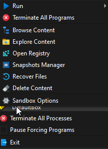

# Tray Icon Menu

To invoke commands from the tray icon menu, right-click the Sandboxie tray icon  that
appears in your system notification area, typically at the lower-right corner of the screen.

* * *

### Show/Hide

This command shows or hides [Sandboxie Control](SP_SBControl.md).

* * *

### Sandbox Sub-Menu

By right-clicking a sandbox, the [Sandbox Submenu](SP_SandboxSubmenu.md) appears.

* * *

### Terminate All Processes

See [Sandbox > Terminate All Processes](SP_SBControl_SandboxMenu.md#terminate-all-processes).

* * *

### Pause Forcing Programs

See [Sandbox > Pause Forcing Programs](SP_SBControl_SandboxMenu.md#pause-forcing-programs).

_Note_: When used from the [Tray Icon Menu](SP_TrayIconMenu.md), this command does not show a dialog box, and automatically
uses the last duration specified, or the default of 10 seconds.

* * *

### Exit

See [Sandboxie Control > Sandbox > Exit](SP_SBControl_SandboxMenu.md#exit).

* * *

Go to [Sandboxie Control](SP_SBControl.md#menus), [Help Topics](HelpTopics.md).

