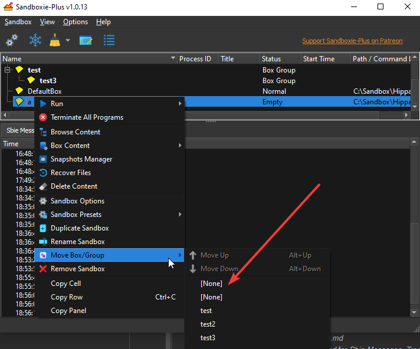

# Comment

Current workflow: once I've gone through updating a page, I prefix it with _SP__. Some non-prefixed pages may be
modified, this means that they've been modified partially (ex: renaming an image) but I haven't properly updated them
yet.

All the non-SP items will be reverted to their original values once we're done, so as not to disturb the original Legacy
Sandboxie documentation.

Naming conventions: _SB_=Sandboxie, _Sb_=Sandbox

Goal of change of names: make articles that are part of the same group appear together in IDEs (ex: settings, tutorial,
etc.)

# Issues found in updating the doc

* The doc changes related to SB-Plus are precesed bu _SP__ (ex _SP_README.md_). We need to revert all the other (non-SP)
  files to the original branch's values before doing the PR once we're finished.
* The old sandboxie calls the main GUI "Sandboxie Control", but the new one is just called "Sandboxie Plus", which
  conflicts with the name of the program. Therefore the portions of the doc that refer to "Sandboxie Control" may be a
  bit confusing. So far I kept "Sandboxie Control" as the name of the main GUI in the doc. Same issue with "Programs
  View", which is now unnamed.
* Shouldn't _Help>Online Documentation_ redirect here (https://sandboxie-plus.github.io/sandboxie-docs) rather
  than https://sandboxie-plus.com/ ?
* Changed _Quick Recovery_ to _Recovery_ to reflect the SB-Plus UI with a "brutal" replacement, might have missed a few
  places to rewrite
* In GettingStartedPartFour.md, it is said "recoverable folders by default are your _Documents_ folder and the Windows _
  Favorites_ folder. Where applicable, your _Downloads_ folder is also considered a recoverable folder.". In the sandbox
  settings it shows three folders: %Desktop%, %Personal% and %{374DE290-123F-4565-9164-39C4925E467B}%. Is the message in
  GettingStarted still accurate ?
* https://github.com/sandboxie-plus/Sandboxie/issues/1692 > when resolved, reflect the chosen behavior in
  GettingStartedPartFive.md and DeleteSandbox.md
* Used _SBOptions_GeneralOptions.md#fileOptions_ in _GettingStartedPartFive.md_, but doesn't exist yet (to replace _
  DeleteSettings.html#invocation_)
* The doc mentions the Sandboxie Forums in several instances. While https://sandboxie-plus.com/ redirects
  to https://forum.xanasoft.com/, the github issues seem to indicate that the current forum
  is https://www.wilderssecurity.com/forums/sandboxie-sbie-open-source-plus-classic.144/. We need to decide which forum
  we put forward, and reflect that in the doc (many places, do a global search on _Favorites_)
* There's a general confusion in the doc between _deleleting a sandbox_ and _deleting a sandbox's content_, which should
  be clarified
* What does the "Remember target selection" dropdown do when checked ? Whether checked or not, the location does not
  change after recovering an item, and is not selected when opening the recovery window again. _Once clarified > update
  Recovery.md_
* Need to create _SBControl_ViewMenu.md_
* Need to create _SBControl_LogView.md_ for _Sbie Messages_, _Trace Log_
* When creating a new box, if you input bad characters in the name, it says "The sandbox name can contain only letters,
  digits and underscores which are displayed as spaces." However, spaces can also be used. Moreover, it's not clear
  whether there's a difference between underscores and spaces. Upon investigation, it would seem that underscores and
  spaces are treated the same (can't create both "a a" and "a__a" sandbox)
  . (https://github.com/sandboxie-plus/Sandboxie/issues/1693 When resolved, update _SandboxMenu.md_)
* Need to create _BoxTypePresets.md_, or create one .md per type of preset and list them in _SandboxMenu.md_
* SBControl>Sandbox>Create Box Group: Why does the "?" button do nothing ? Why can we create a group with the same name
  twice ? (solved > create BoxGroups.md. Line to consider: "Related [Sandboxie Ini](SandboxieIni.md)
  setting: BoxDisplayOrder.") {Creating a group whose name already exists seems to do nothing, we should have a
  warning/...} //
*  Why do we have twice [None] https://github.com/sandboxie-plus/Sandboxie/issues/1698 {when I
  right click a group > create new box, the new box gets created at the root instead of in the group} ? Why is move
  up/down always greyed ? Why don't the groups have the group icon (in the creation menu) instead of a sandbox icon ?
* "Pause Forcing Programs" > same UI issue as "Create Box Group", the "?" button doesn't do anything. Also: would be
  nice to have an indicator of remaining time.
* SBControl > Sandbox > Maintenance: What do those options do ? (> SandboxMenu.md, or their own .md file))
* SBControl > "Status" column: what are the possible values (both for program and sandbox) (> ProgramsView.md)
* Using Shift+F10 to make the context menu appear: the context menu appears at the mouse position, however this shortcut
  is (?) for users who prefer using the keyboard, so it would probably be better to make it appear at the selected row's
  location ?
* Need to create SandboxSubmenu to replace SP_SBControl_SandboxMenu.md#sandbox-sub-menu
* Right click a program running in a sandbox > Preset > Pin to run menu: even when already pinned, the checkbox isn't
  selected. If selected again, it doesn't un-pin the program. https://github.com/sandboxie-plus/Sandboxie/issues/1694
* Right click program > Preset. What do "Block and terminate", "Set linger process" and "Seat leader process" do ?
* sandbox > Run > Run Program. It says "type '.' to explore your Desktop with Sbie", but when I enter '.' it explores my
  Documents folder instead
* sandbox > Run > Boxed Tools: why a separate submenu ? (> SandboxSubmenu x2) Also in Registry Editor: before when
  opening the reg editor it displayed a message saying that we should be careful because the reg editor is not sandboxed
  and we should be careful to only make changes to the right folders. Now it launches a regedit that's sandboxed and
  doesn't show a warning, does it mean it's safe ? /Doing it via the system tray > regedit does display the message.
  Same as box > Box Content > open registry/ ==> in the doc, how do we clearly explain the two different usages ?
* Termonology: "Terminate all processes" in Sandbox> vs "Terminate all programs" in sandbox> (same from tray)
* Need to create SnapshotsManager.md
* What do the admin options do exactly {sandbox > sandbox presets > ..., options > general > admin rights} ? (>
  SandboxSubmenu.md, Generaloptions.md)
* What does "Allow Network Share" {sandbox > sandbox presets > allow ...} do ? (SandboxSubmenu.md)
* FAQ _How does Sandboxie protect me, technically?_ > outdated last link _If you want to follow the future development
  on this,
  see [New privacy enhanced File/Registry access scheme, White list/Template Mode, plans and discussion](https://github.com/sandboxie-plus/Sandboxie/issues/890)
  _, should probably redirect to the new enhanced sandboxes, article to be created
* Terminology Forced Process vs Forced Program (legacy process, SBPlus UI Program)
* If a program is in a Forced Folder / Forced Program for several sandboxes, who has priority ? (> ForceFolderProcess.md)